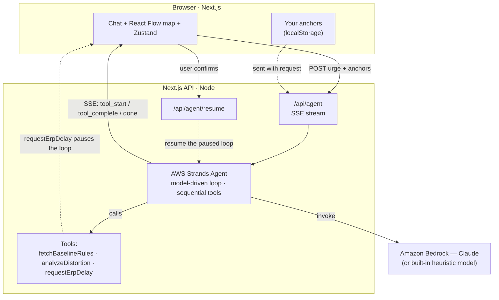

# ClarityAnchor 🪝

An AI-powered **"Reality Anchor"** for OCD and anxiety, built on **AWS Strands
Agents**. Describe an intrusive urge and a Strands agent grounds it against your
own "Calm Ground Rules", names the cognitive distortion at play, and guides an
Exposure & Response Prevention (ERP) delay — visualizing its entire
chain-of-thought live on a React Flow "Diagnostic Map".

Built for the [Agents for Humans](https://agentsforhumans.devpost.com/)
hackathon (Everyday Agents track).

- **Model-driven agent** — AWS Strands Agents (`@strands-agents/sdk`) with three
  tools: `fetchBaselineRules`, `analyzeDistortion`, `requestErpDelay`.
- **Live diagnostic map** — the agent streams its tool calls over SSE; each is
  drawn as a node that goes blue (thinking) → green (resolved).
- **Human-in-the-loop ERP** — when the agent recommends a delay, it *pauses* and
  waits for you to sit with the urge and click **Commit to Delay** before
  resuming.
- **Your rules, persisted** — save your Calm Ground Rules locally; the agent uses
  them instead of defaults.

---

## Getting started

Requires **Node.js 22+** and **pnpm**.

```bash
pnpm install
pnpm dev
# http://localhost:3000        landing page
# http://localhost:3000/app    the app
# http://localhost:3000/docs   docs + architecture diagram
```

That's it — **no API key or configuration is required.** Out of the box the app
runs on a credential-free scripted model (`MockModel`) that exercises the full
Strands agent loop (tool selection → execution → ERP pause → answer). This is the
recommended mode for the demo because it's deterministic. Click a suggestion card
on the left to see it in action.

### Running with a real LLM (AWS Bedrock)

Strands Agents' default provider is **Amazon Bedrock** (Anthropic Claude). To
drive the agent with a real model:

1. **Enable model access** in the AWS Bedrock console for
   `Claude Sonnet` in your region — see
   [Bedrock model access](https://docs.aws.amazon.com/bedrock/latest/userguide/model-access.html).
   (Strands defaults to model id `global.anthropic.claude-sonnet-4-6`.)

2. **Provide AWS credentials** in `.env.local` (or `.env`) — any one of:
   - IAM keys: `AWS_ACCESS_KEY_ID`, `AWS_SECRET_ACCESS_KEY`
     (plus `AWS_SESSION_TOKEN` if temporary), **or**
   - a Bedrock API key: `AWS_BEARER_TOKEN_BEDROCK`, **or**
   - `aws configure` / `aws sso login` (your local AWS profile).

   When AWS credentials are present the app **auto-detects** them and drives the
   agent with Bedrock — no other setting required. Optional overrides:
   `AWS_REGION` (default `us-west-2`), `BEDROCK_MODEL_ID`
   (default `global.anthropic.claude-sonnet-4-6`), `DEMO_LATENCY_MS=0`, or
   `MODEL_PROVIDER=mock` to force the offline heuristic even with keys present.

3. **Restart** the dev server (`pnpm dev`) so it picks up the env, then run an
   analysis. The nav-bar pill turns green **"Bedrock connected."**

Prefer not to touch env files? Click the **gear → paste a Bedrock API key** (BYOK).
It's stored only in your browser and takes effect immediately, no restart.

---

## Architecture



The agent framework is **AWS Strands Agents**; the model is **Amazon Bedrock**
(with a credential-free heuristic fallback). Every lifecycle event is streamed
to the browser over SSE and drawn on the map as it happens.

- **Streaming**: `/api/agent` iterates `agent.stream()` and forwards lifecycle
  events as Server-Sent Events.
- **ERP pause**: the `requestErpDelay` tool `await`s a per-run promise held in a
  `globalThis` registry (`src/lib/strands/erpRegistry.ts`); `/api/agent/resume`
  resolves it. This blocks the whole agent loop without any snapshotting.

## Project structure

```
src/
  app/
    api/agent/route.ts          SSE stream of the agent's chain-of-thought
    api/agent/resume/route.ts   resume a paused ERP delay
    page.tsx                    3-pane layout (chat | map | tabs)
  components/
    panels/ChatPanel.tsx        left: chat + live trace + suggestion cards
    panels/RightPanel.tsx       right: tabbed Ground Rules / Node Details
    flow/                       ThoughtNode + DiagnosticMap
    ErpDelayPanel.tsx           3-minute ERP countdown + commit
  lib/strands/
    agent.ts                    Strands Agent + 3 tools + resolveModel()
    mockModel.ts                credential-free scripted model
    erpRegistry.ts              ERP pause/resume coordination
  samples/data/*.json           demo scenarios (auto-loaded as suggestion cards)
  store/useGraphStore.ts        Zustand: graph, SSE consumer, ERP, settings
```

### Adding a demo sample

Drop a new JSON file in `src/samples/data/` — it's picked up automatically as a
suggestion card (no code change):

```json
{
  "id": "my-scenario",
  "emoji": "🌀",
  "title": "Short title",
  "prompt": "The urge the user types…",
  "baselineRules": ["optional rules to seed if the user has none"]
}
```
