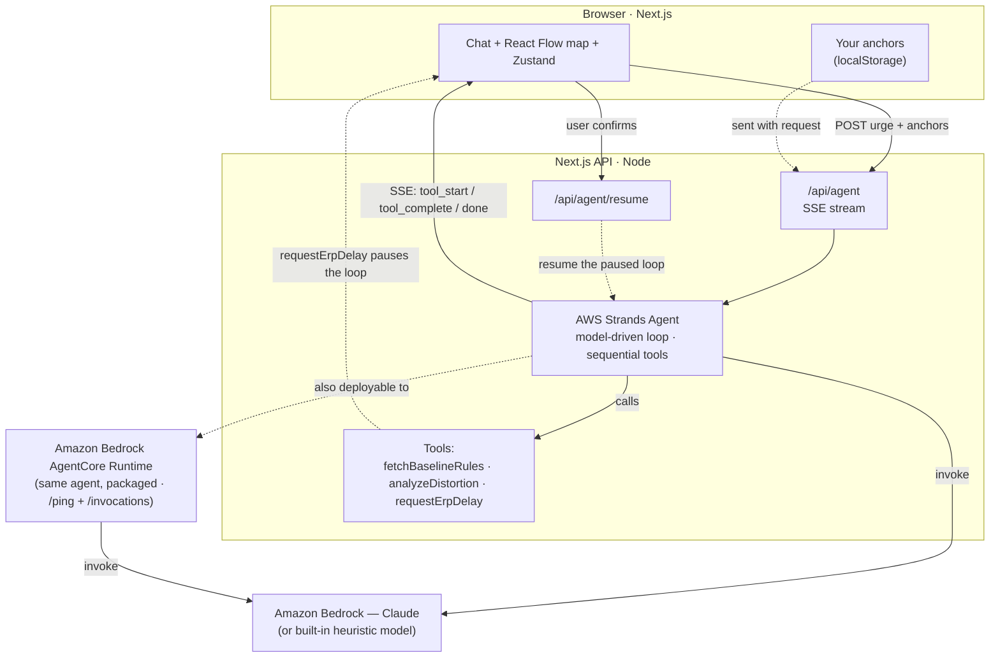

# ClarityAnchor 🪝

🎥 **[Demo video](https://youtu.be/R7gNbTCXNYY)** &nbsp;·&nbsp; 🌐 **[Live site](http://52.26.253.109/)** &nbsp;·&nbsp; ✍️ **[Blog post](https://builder.aws.com/content/3JKwXeeHHhJUzWISOdq3lDojGzj/building-clarityanchor-for-agents-for-humans-an-ai-reality-anchor-that-knows-when-not-to-act)**

An AI-powered **"Reality Anchor"** for OCD and anxiety, built on **AWS Strands
Agents**. Describe an intrusive urge and a Strands agent grounds it against your
own "Calm Ground Rules", names the cognitive distortion at play, and guides an
Exposure & Response Prevention (ERP) delay — visualizing its entire
chain-of-thought live on a React Flow "Diagnostic Map".

Built for the [Agents for Humans](https://agentsforhumans.devpost.com/)
hackathon (Everyday Agents track).

- **Model-driven agent** — AWS Strands Agents (`@strands-agents/sdk`) with three
  tools: `fetchBaselineRules`, `analyzeDistortion`, `requestErpDelay`.
- **Live diagnostic map** — the agent streams its tool calls over SSE; each is
  drawn as a node that goes blue (thinking) → green (resolved).
- **Human-in-the-loop ERP** — when the agent recommends a delay, it *pauses* and
  waits for you to sit with the urge and click **Commit to Delay** before
  resuming.
- **Your rules, persisted** — save your Calm Ground Rules locally; the agent uses
  them instead of defaults.

---

## Getting started

**Try it live:** [http://52.26.253.109/](http://52.26.253.109/) — no install needed.
The hosted site is already configured with **Amazon Bedrock**; you can also bring
your own key in the app (gear → paste a Bedrock API key).

To run it locally, requires **Node.js 22+** and **pnpm**.

```bash
pnpm install
pnpm dev
# http://localhost:3000        landing page
# http://localhost:3000/app    the app
# http://localhost:3000/docs   docs + architecture diagram
```

### Running with a real LLM (AWS Bedrock) — recommended

Strands Agents' default provider is **Amazon Bedrock** (Anthropic Claude), and this
is the recommended way to run the app for real responses. First, **enable model
access** in the AWS Bedrock console for `Claude Sonnet` in your region — see
[Bedrock model access](https://docs.aws.amazon.com/bedrock/latest/userguide/model-access.html).
(Strands defaults to model id `global.anthropic.claude-sonnet-4-6`.)

Then provide credentials **either** way:

**A — `.env.local` (or `.env`)**, any one of:
   - IAM keys: `AWS_ACCESS_KEY_ID`, `AWS_SECRET_ACCESS_KEY`
     (plus `AWS_SESSION_TOKEN` if temporary), **or**
   - a Bedrock API key: `AWS_BEARER_TOKEN_BEDROCK`, **or**
   - `aws configure` / `aws sso login` (your local AWS profile).

   The app **auto-detects** these on start — no other setting required. **Restart**
   `pnpm dev` after editing env; the nav-bar pill turns green **"Bedrock
   connected."** Optional overrides: `AWS_REGION` (default `us-west-2`),
   `BEDROCK_MODEL_ID` (default `global.anthropic.claude-sonnet-4-6`),
   `DEMO_LATENCY_MS=0`.

**B — in-app BYOK (no env files)**: click the **gear → paste a Bedrock API key**.
It's stored only in your browser and takes effect immediately, no restart.

### Offline heuristic model (no credentials)

Without any credentials, the app falls back to a scripted, credential-free model
(`MockModel`) that still exercises the full Strands agent loop (tool selection →
execution → ERP pause → answer). It's deterministic — useful for a quick look or an
offline demo — but its grounding answers are canned, so use Bedrock above for real
responses. (Set `MODEL_PROVIDER=mock` to force it even when credentials are present.)

---

## Architecture

<!-- Diagram source: docs/architecture.mmd (keep this block in sync with it). -->



The agent framework is **AWS Strands Agents**; the model is **Amazon Bedrock**
(with a credential-free heuristic fallback). Every lifecycle event is streamed
to the browser over SSE and drawn on the map as it happens.

- **Streaming**: `/api/agent` iterates `agent.stream()` and forwards lifecycle
  events as Server-Sent Events.
- **ERP pause**: the `requestErpDelay` tool `await`s a per-run promise held in a
  `globalThis` registry (`src/lib/strands/erpRegistry.ts`); `/api/agent/resume`
  resolves it. This blocks the whole agent loop without any snapshotting.

## Tech stack

- **Agent framework** — AWS Strands Agents SDK (`@strands-agents/sdk`)
- **Model** — Amazon Bedrock (Anthropic Claude), with a credential-free heuristic fallback
- **Frontend** — Next.js (App Router), React 19, TypeScript
- **Diagnostic map** — React Flow (`@xyflow/react`)
- **State** — Zustand
- **Styling** — Tailwind CSS, next-themes
- **Streaming** — Server-Sent Events (SSE)
- **Deploy** — Docker → Amazon ECR → EC2 (nginx); the agent is also packaged for
  Amazon Bedrock AgentCore Runtime — see [`deploy/README.md`](deploy/README.md)

## Hackathon

- Built for [Agents for Humans Hackathon](https://agentsforhumans.devpost.com/)
- **Track** — Everyday Agents
- **Eligibility**
  - Built on the **AWS Strands Agents** SDK — a model-driven agent with three tools
    (`fetchBaselineRules`, `analyzeDistortion`, `requestErpDelay`)
  - Runs on **Amazon Bedrock** (Anthropic Claude)
  - A genuine **human-in-the-loop** agent — the ERP pause suspends the agent loop
    until the user commits, then resumes it
  - Also packaged for **Amazon Bedrock AgentCore Runtime** ([`agentcore/`](agentcore/))
  - **Deployed on AWS** — Docker image on EC2, pulled from ECR, Bedrock reached via
    an IAM instance role
- **Links** — [Demo video](https://youtu.be/R7gNbTCXNYY) ·
  [Live site](http://52.26.253.109/) ·
  [Blog post](https://builder.aws.com/content/3JKwXeeHHhJUzWISOdq3lDojGzj/building-clarityanchor-for-agents-for-humans-an-ai-reality-anchor-that-knows-when-not-to-act)
